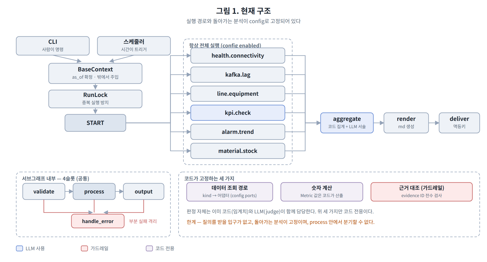
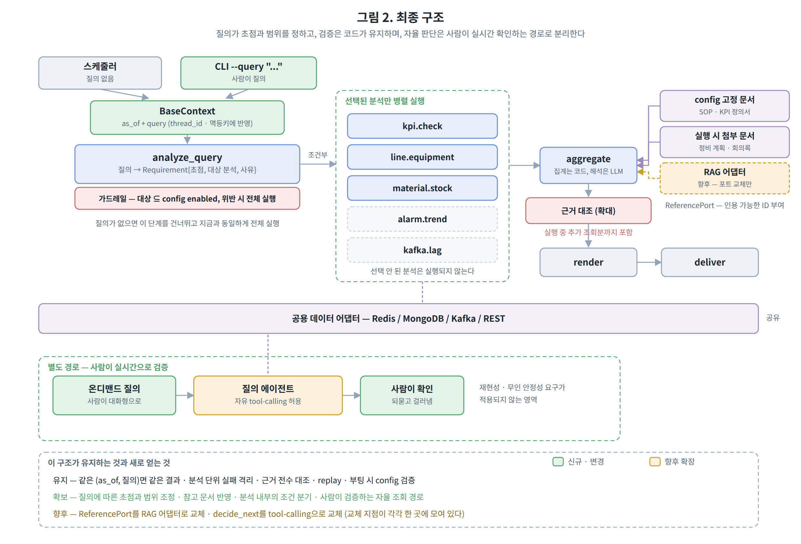
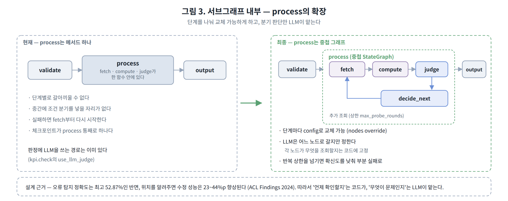

# LLM 자율성 확대 방향 기술 검토

작성일: 2026-08-26
대상 시스템: langgraph-template (제조 운영 지표 분석·리포팅 파이프라인)
검토 범위: 파이프라인 통합 및 tool-calling 기반 자율 판단 구조로의 전환 타당성

---

## 1. 검토 배경

현재 파이프라인은 분석 단위를 여러 서브그래프로 나누고, 각 단계의 실행 순서와 데이터 조회 경로를 코드가 결정합니다. 이에 대해 **하나의 프롬프트에 맥락을 모두 담고, LLM이 tool-calling으로 필요한 데이터를 스스로 조회하며 판단하도록 맡기는 구조**로 전환하는 방향이 제안되었습니다.

이 방향의 타당성을 판단하기 위해 관련 연구 문헌과 공개 벤치마크 자료를 조사했습니다. 아래 내용은 그 결과이며, **결론은 "방향 자체는 유효하되, 적용 범위와 순서를 설계해야 한다"**입니다.

본 문서의 수치는 모두 원 논문 또는 원 자료에서 직접 확인한 것입니다. 확인하지 못한 항목은 그렇다고 명시했습니다.

---

## 2. 제안이 지적한 문제는 실재합니다

현재 판정 로직의 상당 부분은 config에 정의된 임계치에 의존합니다. 이 방식의 한계는 분명합니다.

- 개별 지표가 모두 정상 범위인데 **조합이 이상한** 경우를 표현하기 어렵습니다.
- 사전에 정의되지 않은 패턴은 감지 대상 자체가 아닙니다.
- 새 판정 기준마다 코드와 config를 함께 수정해야 합니다.

규칙 기반 판정만으로는 부족하다는 문제 제기는 타당하며, LLM으로 이를 보완하려는 방향에 이견은 없습니다.

---

## 3. 현재 구조에 이미 반영된 부분

검토 과정에서 확인한 사실인데, 현행 구조는 LLM을 서술 생성에만 쓰고 있지 않습니다. LLM 어댑터에는 두 개의 진입점이 있습니다.

| 메서드 | 역할 |
|---|---|
| `narrate()` | 자유 서술 문장 생성 |
| `judge()` | **구조화된 판정 생성** — 심각도, 판단 근거, 참조 데이터 ID, 확신도를 LLM이 직접 결정 |

`kpi.check` 분석은 이미 `judge()`를 사용해 "개별 임계치로는 잡히지 않는 이상 신호"를 판정하고 있으며, `use_llm_judge` 설정으로 규칙과 LLM의 비중을 조절할 수 있습니다.

즉 **코드가 반드시 담당하도록 고정한 영역은 세 가지**입니다.

1. 데이터를 어디서 어떤 시점 기준으로 가져오는가
2. 리포트에 표시되는 숫자 값의 계산
3. LLM이 제시한 근거 ID가 실제 입력 데이터에 존재하는지 대조

판단 영역은 이미 열려 있으므로, 논의의 실질은 **"위 세 가지까지 LLM에 위임할 것인가"**입니다.

현재 구조에서 확인되는 제약은 세 가지입니다. **질의를 받을 입구가 없고**, 실행되는 분석이 config로 **고정**되어 있으며, `process`가 메서드 하나라 **내부에서 분기할 수 없습니다.** 뒤에서 제시하는 최종 구조는 이 세 가지를 푸는 것을 목표로 합니다.

---

## 4. 조사 결과 (1) — 능력과 일관성은 별개의 축입니다

먼저 명확히 해둘 점이 있습니다. **"LLM 에이전트는 복잡한 작업을 못한다"는 주장은 더 이상 성립하지 않습니다.** 2023년 기준으로 널리 인용되던 격차(GAIA 벤치마크에서 사람 92% 대 에이전트 15%, WebArena에서 사람 78% 대 에이전트 14%)는 이후 대부분 해소되었습니다. 능력을 근거로 한 반대는 유효하지 않습니다.

문헌에서 일관되게 확인되는 문제는 능력이 아니라 **같은 작업을 반복했을 때의 일관성**입니다. 무인 배치 시스템에서는 이쪽이 훨씬 중요한 지표입니다.

### 4-1. 동일 작업 반복 시 성공률 붕괴 (τ-bench)

Sierra AI의 Yao 등이 발표한 τ-bench는 tool-calling 에이전트를 평가하면서 `pass^k`라는 지표를 제안했습니다. **같은 작업을 k번 실행했을 때 k번 모두 성공할 확률**입니다. 흔히 쓰는 `pass@k`(k번 중 한 번이라도 성공)의 반대 개념으로, 운영 신뢰성에 직접 대응합니다.

논문 초록의 서술은 다음과 같습니다.

> "even state-of-the-art function calling agents (like gpt-4o) succeed on <50% of the tasks, and are quite inconsistent (pass^8 <25% in retail)."

구체적으로 gpt-4o는 retail 도메인에서 `pass^1` 61.2%였으나 `pass^8`은 25% 미만으로 떨어집니다. **작업 난이도가 올라간 것이 아니라, 같은 작업이 8번 연속 성공해야 한다는 조건만 추가했을 때 상대적으로 약 60% 하락**한 것입니다.

일간 리포트가 매일 같은 분석을 수행한다는 점을 고려하면, 이 지표가 우리 상황에 가장 가깝습니다.

### 4-2. 신뢰 수준을 높이면 처리 가능 범위가 급감 (METR)

METR이 NeurIPS 2025에 발표한 연구는 "AI가 몇 % 성공률로 처리 가능한 작업의 길이"를 측정했습니다. 논문 본문의 서술입니다.

> "Claude 3.7 Sonnet has the longest 80%-horizon among models we examined at around 15 minutes, in contrast to its 50%-horizon of 59 minutes."

즉 성공률 기준을 50%에서 80%로 올리는 것만으로 처리 가능한 작업 길이가 **약 4분의 1로 줄어듭니다.** METR이 공개한 최신 데이터에서 이 비율은 GPT-4 세대부터 최신 모델까지 **일관되게 4~6배**로 나타납니다.

| 모델 | 50% 기준 | 80% 기준 | 비율 |
|---|---|---|---|
| GPT-4 | 3.99분 | 0.89분 | 4.5배 |
| o1 | 38.83분 | 7.09분 | 5.5배 |
| Claude 3.7 Sonnet | 60.39분 | 12.09분 | 5.0배 |
| Claude Opus 4.5 | 293.00분 | 49.43분 | 5.9배 |
| GPT-5.2 | 352.25분 | 66.00분 | 5.3배 |

주목할 점은 **이 비율이 세대가 지나도 좁혀지지 않는다**는 것입니다. 논문은 50% 기준의 배가 주기(212일)와 80% 기준의 배가 주기(213일)가 사실상 같다고 보고합니다. 절대 능력은 빠르게 향상되지만 **능력과 신뢰성 사이의 간극 자체는 그대로 이동**합니다. 모델 세대 교체를 기다려 해결될 성질이 아닙니다.

### 4-3. 상호작용이 길어질수록 일관성 저하 (Laban 등)

Salesforce/Microsoft 연구진의 2025년 연구는 단일 턴과 다중 턴 성능을 비교했습니다.

> "all the top open- and closed-weight LLMs we test exhibit significantly lower performance in multi-turn conversations than single-turn, with an average drop of 39% across six generation tasks. Analysis of 200,000+ simulated conversations decomposes the performance degradation into two components: a minor loss in aptitude and a significant increase in unreliability... when LLMs take a wrong turn in a conversation, they get lost and do not recover."

**성능 저하의 원인이 능력 손실이 아니라 일관성 저하**라는 분해 결과가 핵심이며, "한 번 잘못된 방향으로 들어서면 스스로 복구하지 못한다"는 관찰은 자율 조회 루프 설계에 직접적인 시사점을 줍니다.

### 4-4. 오류는 단계가 쌓일수록 가속됩니다 (Sinha 등)

ICLR 2026에 채택된 연구는 단계별 오류 누적을 분석했습니다. 흔히 쓰는 "단계별 정확도의 거듭제곱" 모델(예: 단계당 95% × 10단계 = 59.9%)은 **실제보다 낙관적**이라는 것이 결론입니다. 단계가 독립적이지 않기 때문입니다.

핵심 기제는 **self-conditioning**입니다. 모델의 컨텍스트에 자신의 이전 오류가 포함되면 이후 단계의 정확도가 추가로 떨어지며, 논문은 이 현상이 **모델 크기를 키워도 해소되지 않는다**고 보고합니다. 다만 명시적 추론(thinking)은 이를 완화한다고 함께 보고하고 있어, 완전한 부정적 결과는 아닙니다.

---

## 5. 조사 결과 (2) — 환각과 가드레일

이 부분을 가장 자세히 조사했습니다. 현재 구조의 근거 대조 검증을 어떻게 조정할지가 이번 결정의 핵심이기 때문입니다.

### 5-1. 환각은 왜 남는가 — 이론적 하한

환각을 "모델이 더 좋아지면 사라질 결함"으로 볼 수 있는지부터 확인했습니다. 문헌의 답은 **아니오**이며, 근거가 세 갈래로 존재합니다.

**통계적 하한.** Kalai와 Vempala가 STOC 2024에 발표한 연구는 **잘 보정된(calibrated) 모델은 반드시 일정 비율로 환각한다**는 하한을 증명했습니다. 학습 데이터에 **정확히 한 번만 등장한 사실**(monofact)에 대한 환각 확률이 대략 Good-Turing 추정치만큼 발생한다는 것입니다.

여기에 실무적으로 중요한 단서가 있습니다. 논문은 **여러 번 등장하는 사실이나 산술처럼 체계적인 사실에 대해서는 이런 통계적 이유가 없다**고 명시합니다. 즉 이론적 하한은 **드물게 등장하는 롱테일 지식**에 관한 것이며, 우리 도메인처럼 데이터가 구조화되어 있고 계산이 체계적인 영역에는 그대로 적용되지 않습니다. 이 구분은 우리 설계에 유리한 방향으로 작동합니다.

**분류 오차로부터의 하한.** OpenAI와 조지아공대 연구진의 2025년 논문은 생성 오류율이 "이것이 유효한 출력인가"를 판별하는 이진 분류 오차의 **약 2배 이상**이라는 관계를 제시합니다.

> (generative error rate) ≳ 2 · (IIV misclassification rate)

이 논문은 또한 환각이 사후 학습 이후에도 남는 이유를 **평가 방식의 유인 구조**로 설명합니다. 벤치마크가 정답/오답 이진으로 채점하면 "모르겠다"고 답하는 것보다 추측하는 것이 항상 유리하므로, 모델이 확신 없는 상황에서도 단정적으로 답하도록 학습된다는 것입니다.

**계산이론적 한계.** Xu 등의 2024년 연구는 형식적 세계에서 환각의 완전한 제거가 불가능함을 보였습니다. 다만 이는 정지문제류의 불가능성 논증으로 **제거 가능성의 상한**을 논하는 것이지, 특정 좁은 도메인에서 실용적 수준까지 낮출 수 없다는 뜻은 아닙니다. 과대 인용에 주의가 필요한 자료입니다.

### 5-2. 정확한 데이터를 준다고 환각이 사라지지 않습니다

"필요한 데이터를 조회해서 보여주면 환각이 해결된다"는 기대가 성립하는지 확인했습니다. 실증 자료는 부정적입니다.

**상용 시스템 실측.** 스탠퍼드 연구진이 사전등록 방식으로 수행한 법률 AI 도구 평가는, RAG 기반이며 벤더가 "환각 없음"을 명시적으로 표방한 상용 제품들을 대상으로 했습니다. 결과는 **17~33% 구간의 환각률**이었습니다. 범용 GPT-4보다는 낮지만 0에 근접하지 않았습니다.

**검색 결과에 대한 과도한 추종.** Wu 등의 ClashEval 연구는 의도적으로 오염된 참조 문서를 제공했을 때 모델 반응을 측정했습니다. GPT-4o를 포함한 6개 최신 모델이 **자신이 원래 알고 있던 올바른 지식을 60% 이상의 비율로 잘못된 검색 결과로 덮어썼습니다.** 모델의 자체 확신도가 낮을수록 검색 결과를 더 맹종하는 경향도 함께 보고되었습니다.

이는 우리 설계에 직접적인 시사점을 줍니다. LLM이 스스로 조회한 데이터가 부분적이거나 부정확할 경우, 모델이 그것을 걸러낼 것으로 기대하기 어렵습니다.

**도구 호출이 늘어날수록 악화.** 2026년 발표된 deep research 에이전트 인용 검증 연구는 흥미로운 비대칭을 보고합니다. 최신 모델들은 **링크 유효성 94% 이상, 주제 관련성 80% 이상**을 유지하지만 **실제 사실 정확도는 39~77%**에 그칩니다. 인용이 형식적으로 잘 갖춰져 있다는 것과 그 인용이 실제로 주장을 뒷받침한다는 것은 별개라는 뜻입니다.

더 중요한 것은 다음 관찰입니다.

> "Fact Check accuracy drops by approximately 42% on average across two frontier models as tool calls scale from 2 to 150."

**도구 호출 횟수가 늘어날수록 근거의 신뢰도가 떨어집니다.** 자율 조회 구조는 정의상 호출 횟수가 늘어나는 구조입니다.

### 5-3. 근거·인용의 정확도 실측

근거 제시를 요구했을 때 실제로 얼마나 정확한지에 대한 정량 자료입니다.

스탠퍼드의 Liu 등이 Findings of EMNLP 2023에 발표한 상용 생성형 검색엔진(Bing Chat, Perplexity, NeevaAI, YouChat) 인적 평가 결과입니다.

> "on average, a mere 51.5% of generated sentences are fully supported by citations and only 74.5% of citations support their associated sentence."

**생성된 문장의 절반 정도만 인용으로 완전히 뒷받침되고, 제시된 인용의 4분의 1은 해당 주장을 실제로 뒷받침하지 않습니다.** 이 두 지표는 각각 근거 재현율(recall)과 근거 정밀도(precision)에 해당하며, 우리 시스템의 `evidence` 대조 검증이 겨냥하는 지점과 정확히 일치합니다.

ALCE 벤치마크(EMNLP 2023) 역시 "최고 성능 모델조차 ELI5 데이터셋에서 절반의 경우 완전한 인용 뒷받침에 실패한다"고 보고합니다.

### 5-4. 모델이 스스로 검증하도록 하면 — 핵심 쟁점

"이상이 있으면 LLM이 스스로 다른 데이터로 확인한다"는 방식의 실효성입니다. 이 부분이 이번 검토에서 가장 근거가 두터운 영역이었습니다.

**자기 교정은 성능을 떨어뜨립니다.** Google DeepMind와 UIUC 연구진이 ICLR 2024에 발표한 연구는, 외부 피드백 없이 모델이 스스로 답을 재검토하도록 했을 때의 정확도 변화를 측정했습니다.

| 모델 | 설정 | GSM8K | CommonSenseQA | HotpotQA |
|---|---|---|---|---|
| GPT-3.5 | 기본 | **75.9** | **75.8** | **26.0** |
| GPT-3.5 | 자기교정 1회 | 75.1 | 38.1 | 25.0 |
| GPT-3.5 | 자기교정 2회 | 74.7 | 41.8 | 25.0 |
| GPT-4 | 기본 | **95.5** | **82.0** | **49.0** |
| GPT-4 | 자기교정 1회 | 91.5 | 79.5 | 49.0 |
| GPT-4 | 자기교정 2회 | 89.0 | 80.0 | 43.0 |

**모든 모델·모든 과제에서 정확도가 하락**했으며, 그 대가로 추론 비용은 3~5배 증가했습니다.

원인을 규명한 답변 변화 분석이 더 중요합니다. GSM8K/GPT-3.5 기준으로 **맞았다가 틀리게 바뀐 비율이 8.8%, 틀렸다가 맞게 바뀐 비율이 7.0%**입니다. CommonSenseQA에서는 격차가 훨씬 큽니다(39.8% 대 5.8%). 논문의 진단은 다음과 같습니다.

> "The fundamental issue is that LLMs cannot properly judge the correctness of their reasoning."

같은 논문에서 **정답 레이블을 외부에서 제공한 경우**에는 결과가 반대로 나타납니다(GPT-4 GSM8K 95.5 → 97.5, HotpotQA 49.0 → 59.0). **개선분은 전적으로 외부 신호에서 나옵니다.**

**검증은 생성보다 쉽지 않습니다.** 애리조나주립대 연구진의 그래프 색칠 실험은 더 직접적입니다. GPT-4가 생성 과정에서 최적해를 만들어낸 인스턴스가 100개 중 40개 있었는데, **검증자 역할의 GPT-4는 그중 단 하나도 정답임을 인식하지 못했습니다.** 39개에서는 존재하지 않는 인접 관계를 지어내며 오답 판정을 내렸습니다.

후속 연구에서 도메인별 검증자 성능을 측정한 결과, 그래프 색칠에서 **위음성률(정답을 오답으로 판정) 95.8%**, Mystery Blocksworld에서 **97.09%**로 나타났습니다.

**근거 검증 과제에 한정한 직접 비교.** 우리 사례에 가장 가까운 자료는 Findings of EMNLP 2025에 발표된 InteGround입니다. 근거가 불완전한 상황에서 LLM 검증자와 전용 분류기를 비교했습니다.

| 검증 방식 | 불완전 근거 판정 정확도 |
|---|---|
| Llama-3.1-8B (LLM 자체 검증) | **18.8%** |
| 지도학습 NLI 분류기 | **79.4%** |
| (무작위 기준선) | 50% |

**LLM 검증자가 무작위보다 현저히 나쁩니다.** 논문이 밝힌 원인은 다음과 같습니다.

> "in groundedness verification, while LLMs are robust to redundant evidence, they tend to rationalize using internal knowledge when information is incomplete."

**근거가 부족할 때 모델이 내부 지식으로 빈틈을 메우고 "근거가 충분하다"고 판정하는 방향으로 치우칩니다.** 이는 무작위 오류가 아니라 **한쪽 방향으로 편향된 실패**이며, 정확히 우리 가드레일이 잡아야 할 상황입니다.

**병목은 수정 능력이 아니라 탐지 능력입니다.** ACL Findings 2024 연구는 이 구분을 명확히 했습니다. 오류 위치를 찾는 정확도는 최고 성능인 GPT-4가 **52.87%**에 그쳤으나, **오류 위치를 외부에서 알려주면** 수정 성능은 과제에 따라 23~44%p 향상되었습니다. 논문의 분석에 따르면 오류 탐지 정확도가 **60~70%는 되어야** 자기 교정 루프가 순이익을 냅니다. 현재 어떤 모델도 그 수준에 도달하지 못했습니다.

이 결과는 방향을 제시하기도 합니다. **"언제 확인해야 하는지"를 코드가 결정하고 "무엇이 잘못됐는지"는 LLM이 판단하는 조합**이 문헌상 가장 성과가 좋습니다.

### 5-5. 모델의 설명은 근거가 아닙니다

NeurIPS 2023에 발표된 Turpin 등의 연구는 모델의 사고 과정 서술이 실제 계산 과정을 반영하는지 검증했습니다. 프롬프트에 편향 요소를 주입했을 때(예: 예시의 정답이 항상 (A)가 되도록 배치) 모델은 그 편향에 체계적으로 영향을 받았지만 **설명에서 이를 전혀 언급하지 않았습니다.** 13개 과제에서 정확도가 최대 36% 하락했습니다.

실무적 함의는 명확합니다. **"이 데이터를 근거로 판단했다"는 모델의 서술 자체는 실제로 그 데이터가 판단에 사용되었다는 증거가 되지 못합니다.** 근거의 유효성은 별도의 기계적 대조로만 확인할 수 있습니다.

### 5-6. 현재 가드레일이 수행하는 역할

위 자료들에 비추어 현행 설계를 다시 정리하면 다음과 같습니다.

현재 `_enforce_evidence`는 LLM이 제시한 근거 ID가 실제 입력 데이터에 존재하는지를 **모델의 판단과 무관하게, 모든 판정에 대해, 예외 없이** 대조합니다. 존재하지 않으면 해당 판정을 폐기하고 부분 실패로 기록합니다.

이 설계가 유효한 이유는 세 가지입니다.

1. **검사기가 LLM이 아닙니다.** 문자열 집합 대조이므로 검사기 자체가 틀릴 가능성이 없습니다. 5-4의 InteGround 결과가 보여주듯, 검사기를 LLM으로 두면 검증 단계가 새로운 오류원이 됩니다.
2. **항상 실행됩니다.** 어떤 출력이 잘못되었는지 사전에 알 수 없으므로 전수 검사가 필요합니다. 검사 시작 여부를 모델 판단에 맡기면, 모델이 확신을 가진 채 틀린 경우가 걸러지지 않습니다.
3. **비용이 0에 가깝습니다.** 따라서 조건부로 실행할 이유가 없습니다.

관련해서 참고할 만한 연구 결과가 있습니다. Bohnet 등은 LLM 기반 근거 평가 지표가 **시스템 단위 집계에서는 인적 평가와 상관계수 0.96**으로 매우 높지만, **개별 응답 단위에서는 "훨씬 낮고 변동이 크다"**고 보고하며 개별 점수를 근거로 판단하지 말 것을 권고합니다. 운영 가드레일은 정의상 개별 응답 단위의 통과/차단 결정이므로, 이 구분이 중요합니다.

### 5-7. 자율 조회로 전환할 경우 가드레일에 생기는 변화

세 가지 조정이 필요합니다.

**첫째, 대조 대상 집합이 실행 중에 변합니다.** 현재는 조회가 끝난 시점에 유효한 ID 집합이 확정되므로 대조가 단순합니다. 자율 조회에서는 집합이 계속 늘어나며, 모델이 조회하지 않은 데이터의 ID를 지어낼 경우 "아직 조회 안 된 것"과 "존재하지 않는 것"을 구분해야 합니다. 대조 로직 자체는 확장 가능하나 설계가 필요합니다.

**둘째, "언제 확인할지"의 결정 주체가 이동합니다.** 이것이 실질적인 변화입니다. 현재는 코드가 전수 검사하지만, "이상하면 모델이 확인한다"로 바꾸면 검사 착수 판단이 모델로 넘어갑니다. 5-4의 자료들은 이 판단(오류 탐지, 최고 52.87%)이 모델의 약한 능력에 해당함을 일관되게 보여줍니다.

**셋째, 확인 절차 자체가 LLM 호출이 됩니다.** 5-4의 InteGround 결과에 비추면 확인 단계의 신뢰도를 별도로 확보해야 하며, 그렇지 않으면 검증이 추가된 것이 아니라 오류 가능 지점이 하나 늘어난 결과가 될 수 있습니다.

---

## 6. 조사 결과 (3) — 재현성

`as_of` 기준 재실행 시 동일 결과 보장에 관한 항목입니다. 조사 결과 **온도 0 설정만으로는 재현성이 확보되지 않는다**는 점이 확인되었으며, 이는 현재 구조에도 이미 해당되는 사항입니다.

Thinking Machines Lab이 2025년 9월 공개한 분석에 따르면, 주된 원인은 GPU 동시성이 아니라 **배치 크기 비불변성(lack of batch invariance)**입니다. 서버 부하에 따라 배치 크기가 달라지고, 부동소수점 덧셈의 비결합성 때문에 리덕션 순서가 바뀌면서 결과가 갈립니다.

실측 사례로, Qwen3-235B 모델에 온도 0으로 동일 프롬프트를 1,000회 입력했을 때 **80가지 서로 다른 응답**이 나왔고 첫 분기는 103번째 토큰에서 발생했습니다. 배치 불변 커널을 적용하면 1,000회 모두 동일해지지만 **지연시간이 약 1.6~2.1배** 증가합니다.

관련 연구도 같은 방향입니다. 5개 모델 × 8개 과제 × 10회 반복 실험에서 **최대 15%의 정확도 편차**와 특정 조합에서 **최대 70%의 최고-최저 격차**가 보고되었습니다. 또 다른 연구는 **GPU 종류, GPU 개수, 배치 크기 변경만으로** bfloat16 기준 최대 9%의 정확도 차이와 최대 9,000토큰의 응답 길이 차이가 발생함을 보고했습니다.

**시사점은 양방향입니다.** 현재의 replay 기능이 중요한 이유가 오히려 강화됩니다. 모델 출력 자체가 완전히 재현되지 않으므로, 저장된 응답을 재생하는 방식이 사실상 유일한 재현 수단입니다. 동시에 자율 조회로 전환하면 호출 궤적까지 가변이 되어 이 수단의 유효 범위가 좁아집니다. 대체 방안을 함께 설계해야 합니다.

참고로 NIST의 AI 위험관리 프레임워크(AI RMF 1.0, 2023)는 AI 고유 위험 요인 목록에 **"재현성에 대한 우려(concerns about reproducibility)"**를 명시하고 있으며, 측정 불가능한 위험은 문서화하도록 권고(MEASURE 1.1)하고 있습니다. 규제가 아닌 자율 프레임워크이지만, 재현성을 설계 항목으로 다루는 근거로 인용 가능합니다.

> **규제 관련 참고**: EU AI Act의 기록보존(제12조)·인간감독(제14조) 의무는 **고위험 시스템에만** 적용되며, 부속서 III에 일반 제조업이나 공장 운영 모니터링은 포함되지 않습니다. 다만 **작업자 관리·평가 용도로 확장될 경우 고위험 분류(4항)에 해당할 수 있습니다.** 또한 2026년 개정으로 고위험 의무 적용 시점이 2027년 12월/2028년 8월로 연기되었습니다. 현 시점에서 규제를 근거로 설계를 제약할 필요는 없으나, 용도 확장 시 재검토가 필요한 항목입니다.

---

## 7. 공정하게 검토한 반대 근거

균형 잡힌 판단을 위해, 위 결론을 약화시키는 자료도 함께 조사했습니다. 실제로 유의미한 반례가 존재합니다.

**학습 단계 개입은 자기 교정을 실제로 개선합니다.** Google DeepMind가 ICLR 2025에 발표한 SCoRe는 다중 턴 강화학습으로 자기 교정 능력을 학습시켰습니다. MATH 벤치마크에서 기본 모델은 턴이 진행되며 52.6% → 41.4%로 하락(5-4의 전형적 패턴)했으나, SCoRe 적용 모델은 60.0% → 64.4%로 **상승**했습니다. 맞았다가 틀리게 바뀌는 비율이 **15.8%에서 1.4%로** 감소했습니다. 다만 학습 과정에서 정답 신호를 사용하므로, "외부 피드백 없이"라는 조건이 추론 시점에서 학습 시점으로 이동한 것으로 볼 여지가 있습니다.

**과제 구조에 따라 자기 검증이 작동합니다.** TACL 2024의 종합 분석은 기존 긍정적 결과 상당수가 불공정한 실험 설정에 기인했다고 지적하면서도, **답변을 분해할 수 있거나 검증 비용이 생성 비용보다 확실히 낮은 과제**에서는 실제로 작동한다는 예외를 함께 제시합니다. Blocksworld 도메인에서는 자기 검증이 기준선(40%)보다 높은 55%를 기록했습니다. 우리 도메인의 판정은 상당 부분 분해 가능한 형태이므로 이 예외에 해당할 여지가 있습니다.

**전용 검증 모델은 저렴하고 정확합니다.** EMNLP 2024의 MiniCheck은 7.7억 파라미터 모델로 **GPT-4 수준의 사실 검증 정확도를 1/400 비용**에 달성했습니다. "검증기는 LLM이면 안 된다"가 아니라 **"검증기는 생성 모델과 분리된, 그 용도로 검증된 별도 구성요소여야 한다"**가 더 정확한 명제입니다. 이는 향후 근거 검증을 정교화할 실질적 선택지입니다.

**구조화된 검증 절차는 효과가 있습니다.** ACL Findings 2024의 Chain-of-Verification은 초안 작성 후 검증 질문을 계획하고 **초안 컨텍스트와 분리된 상태에서** 답하게 하여 환각을 줄였습니다. 작동 원리가 "검증을 초안으로부터 격리"하는 데 있다는 점은, 자율 루프 안에서 같은 모델이 이어서 확인하는 방식과 대비됩니다.

**샘플링 기반 일관성 검사도 유효합니다.** SelfCheckGPT(EMNLP 2023)는 외부 데이터베이스 없이 여러 샘플 간 일관성만으로 환각을 탐지합니다. 다만 이는 모델 내부의 안정성을 측정하는 것이지 우리 데이터와의 정합성을 측정하는 것이 아니므로, 근거 대조를 대체하지 않고 보완합니다.

**공통 시사점.** 여러 논문이 일치하는 실무 권고가 하나 있습니다. **같은 비용이면 자기 비판 루프보다 외부 검증기나 다중 샘플링에 쓰는 편이 낫다**는 것입니다. ICLR 2024 연구에서 동일 호출 예산(9회) 기준으로 다중 에이전트 토론은 83.0%, 단순 다수결(self-consistency)은 88.2%였습니다.

---

## 8. 최종적으로 가야 할 구조

지금까지의 조사 결과를 반영해, 최종적으로 도달할 형태를 제시합니다. 제안된 방향(질의 기반 자율 판단)을 **버리지 않고 배치를 조정한** 구조입니다.

### 8-1. 설계 원칙

문헌에서 반복적으로 확인된 세 가지를 원칙으로 삼았습니다.

**첫째, 자율성은 검증자가 있는 곳에 둡니다.** 5-4에서 정리했듯 문제는 자율 판단 자체가 아니라 **검증자 없이 궤적이 길어지는 것**입니다. 사람이 실시간으로 확인하는 경로에서는 사람이 검증자 역할을 하므로 자유로운 조회를 허용해도 위험 구조가 다릅니다.

**둘째, 판단과 검증의 주체를 분리합니다.** 오류 탐지 정확도가 최고 52.87%인 반면 위치를 알려주면 수정은 잘 한다는 결과(5-4)에 따라, **"언제 확인할지"는 코드가 정하고 "무엇이 문제인지"는 LLM이 판단**하는 형태로 역할을 나눕니다.

**셋째, 교체 지점을 한 곳에 모읍니다.** 지금 당장 도입하지 않을 기능(RAG, 자유 tool-calling)도 나중에 **한 지점만 바꾸면 되도록** 포트와 메서드 경계를 미리 그어둡니다.

### 8-2. 전체 구조

현재 구조 대비 달라지는 지점은 다섯 가지입니다.

**질의 분석 노드(`analyze_query`)가 START와 분석 사이에 들어갑니다.** 자연어 질의를 `Requirement`(관심 초점, 대상 분석 목록, 선정 사유)라는 구조화된 값으로 변환합니다. 여기에 **가드레일이 붙습니다** — 선택된 대상이 config에서 `enabled`된 집합의 부분집합이어야 하며, 위반하면 그 선택을 폐기하고 전체 실행으로 되돌립니다. 현재 `_enforce_evidence`가 근거 ID에 하는 일과 정확히 같은 패턴이라, 새로운 개념을 도입하지 않습니다.

**질의가 실행 식별자에 포함됩니다.** 질의가 실행 범위를 바꾸는 이상 `as_of`와 동급의 입력이므로, `thread_id`와 발송 멱등키에 반영해야 합니다. 그렇지 않으면 같은 시각에 질의만 다른 두 실행이 같은 체크포인트를 공유해 이전 질의의 섹션이 남습니다. 이 조정으로 **"같은 (`as_of`, 질의)면 같은 결과"**라는 재현성 보증이 유지됩니다.

**조건부 fan-out으로 선택된 분석만 실행됩니다.** 선택되지 않은 분석은 아예 실행되지 않으므로 비용과 시간이 함께 줄어듭니다. **질의가 없으면 이 단계를 건너뛰고 지금과 동일하게 전체를 실행**하므로, 새벽 스케줄러의 동작과 리포트 포맷은 바뀌지 않습니다.

**참고 문서가 `ReferencePort`를 통해 취합 단계에 들어갑니다.** config에 고정한 운영 문서(SOP, KPI 정의서)와 실행 시 첨부한 문서(정비 계획, 회의록)를 같은 형태로 다루고, 각 문서에 **인용 가능한 ID를 부여**해 근거 대조 대상에 포함시킵니다. 이 포트 구조가 RAG로 가는 문을 열어둡니다 — 나중에 벡터 검색 어댑터를 만들어 config에서 갈아끼우면 되고, 취합 노드 코드는 바뀌지 않습니다.

**자율 판단이 별도 경로로 분리됩니다.** 자유 tool-calling은 사람이 그 자리에서 답을 확인하고 되물을 수 있는 온디맨드 질의 기능에 배치합니다. 재현성과 무인 안정성 요구가 적용되지 않는 영역입니다. 데이터 어댑터는 무인 파이프라인과 공유하므로 데이터 계층을 새로 만들 필요가 없습니다.

### 8-3. 서브그래프 내부

`process`를 메서드 하나에서 **중첩 그래프**로 바꿉니다. `fetch`, `compute`, `judge`는 여전히 클래스 메서드이므로 지금의 config `nodes` 교체 메커니즘이 그대로 적용되고, 동시에 조건 분기와 반복이 가능해집니다.

분기는 `decide_next` 한 곳이 담당합니다. **LLM은 어느 노드로 갈지만 구조화된 값으로 결정하고, 각 노드가 무엇을 조회할지는 코드에 고정**되어 있습니다. 조회 범위는 `required_kinds`에 선언된 것을 벗어나지 않으므로 부팅 시점의 config 검증이 계속 작동합니다.

반복 상한(`max_probe_rounds`)을 두는 근거는 5-2의 결과입니다. 도구 호출이 2회에서 150회로 늘 때 근거 정확도가 평균 42% 하락하므로, 상한을 넘기면 확신도를 낮춰 부분 실패로 처리합니다.

이 구조는 4-4의 self-conditioning 결과에도 대응합니다. 분석 단위로 궤적을 짧게 유지하면 모델이 자신의 이전 오류를 컨텍스트에 누적시키는 범위가 제한됩니다.

향후 자유 tool-calling으로 확대할 경우에도 **`decide_next` 하나만 교체**하면 되고 나머지 구조는 유지됩니다.

### 8-4. 도달 경로

전면 전환이 아니라 적용 범위를 좁혀 검증한 뒤 확대하는 순서를 제안합니다.

**1단계 — 대상 축소.** 이미 규칙과 LLM 판정이 공존하는 `kpi.check`에서 먼저 적용합니다. 변경 범위가 가장 작습니다.

**2단계 — 분석 단위 격리 유지.** 전체를 단일 프롬프트로 통합하지 않고 각 분석 내부에서만 자율성을 확대합니다. 한 분석의 실패나 지연이 리포트 전체로 번지지 않습니다.

**3단계 — 분기 결정과 조회 대상 분리.** 8-3의 형태로 `decide_next`를 도입하되 조회 범위는 선언된 것으로 제한합니다.

**4단계 — 근거 검증 유지 및 확대.** 대조 검사를 전수로 유지하되, 대상 집합에 실행 중 추가 조회된 데이터를 포함시킵니다. 5-4의 자료를 고려하면 이 검사를 조건부로 바꾸는 것은 권하지 않습니다.

**5단계 — 상한 설정.** 분석당 추가 조회 횟수와 제한 시간을 config에 명시합니다.

**6단계 — 호출 궤적 기록.** 중간 조회 요청과 결과를 함께 기록합니다. 다만 6절에서 정리한 대로 재생 기능은 "응답 재생"에서 "궤적 재생"으로 성격이 바뀌며, 완전한 결과 일치는 보장하기 어렵습니다. 이 점은 사전 합의가 필요합니다.

**7단계 — 측정 후 확대 판단.** 확대 여부는 세 지표로 판단합니다. 규칙이 놓치던 사례의 실제 탐지 건수, 동일 `as_of` 반복 실행 시 판정 일치율(τ-bench의 `pass^k`에 해당), 실행당 토큰 비용과 소요 시간의 분산.

---

## 9. 종합

조사 결과를 정리하면 다음과 같습니다.

1. **능력을 근거로 한 반대는 성립하지 않습니다.** 에이전트의 절대 성능은 빠르게 향상되었고 과거 격차는 대부분 해소되었습니다.
2. **일관성은 별개의 축이며, 무인 배치 환경에서는 이쪽이 결정적입니다.** 동일 작업 8회 반복 성공률은 1회 성공률 대비 크게 떨어지고(61.2% → 25% 미만), 신뢰 수준을 50%에서 80%로 올리면 처리 가능 범위가 4~6배 줄며, 이 비율은 세대가 지나도 개선되지 않습니다.
3. **환각은 데이터를 제공한다고 해소되지 않습니다.** 상용 RAG 시스템 실측 17~33%, 오염된 참조에 대한 추종 60% 이상, 인용의 실제 뒷받침률 74.5%.
4. **근거 검증에서 LLM 자체 검증은 결정론적 검증을 대체하지 못합니다.** 불완전 근거 판정에서 LLM 18.8% 대 전용 분류기 79.4%이며, LLM의 실패는 "근거가 충분하다"는 방향으로 편향됩니다.
5. **다만 검증기가 반드시 규칙 기반일 필요는 없습니다.** 생성 모델과 분리되고 해당 용도로 검증된 구성요소라면 신경망이어도 무방하며, 전용 검증 모델은 비용 대비 성능이 우수합니다.
6. **오류 탐지가 병목이고 오류 수정은 아닙니다.** 따라서 "언제 확인할지는 코드가, 무엇이 문제인지는 LLM이" 판단하는 조합이 문헌상 가장 성과가 좋습니다.
7. **도달 형태와 순서는 8절에 정리했습니다.** 제안된 방향을 폐기하는 것이 아니라, 자율 판단을 검증자가 있는 경로에 배치하고 무인 경로에는 범위를 제한해 단계적으로 넓히는 구조입니다.

### 병행 검토 제안

무인 리포트 파이프라인과 별개로, **사람이 직접 질의하고 즉시 답을 받는 온디맨드 기능**을 함께 검토할 것을 제안합니다.

문헌이 지적하는 위험은 대부분 **검증자가 없는 상태에서 궤적이 길어질 때** 발생합니다. 사람이 결과를 즉시 확인하고 되물을 수 있는 환경에서는 사람이 그 검증자 역할을 수행하므로, 자유로운 데이터 조회를 허용해도 위험 구조가 다릅니다. 재현성과 무인 안정성 요구도 적용되지 않습니다.

구현 부담도 크지 않습니다. 기존 데이터 어댑터를 도구로 감싸면 되고, 관련 구현 패턴은 사내 참고 문서(`ref/07-react-agents.md`)에 정리되어 있습니다.

---

## 부록 — 참고 문헌

**에이전트 신뢰성**

- Yao, S. et al. (2024). *τ-bench: A Benchmark for Tool-Agent-User Interaction in Real-World Domains.* Sierra AI. arXiv:2406.12045
- Kwa, T. et al. (2025). *Measuring AI Ability to Complete Long Software Tasks.* METR. NeurIPS 2025. arXiv:2503.14499
- Laban, P. et al. (2025). *LLMs Get Lost In Multi-Turn Conversation.* Salesforce AI / Microsoft. arXiv:2505.06120
- Sinha, A. et al. (2025). *The Illusion of Diminishing Returns: Measuring Long Horizon Execution in LLMs.* ICLR 2026. arXiv:2509.09677
- Kapoor, S. et al. (2025). *Holistic Agent Leaderboard.* Princeton 외. arXiv:2510.11977
- Zhu, Y. et al. (2025). *Establishing Best Practices for Building Rigorous Agentic Benchmarks.* arXiv:2507.02825

**자기 검증의 한계**

- Huang, J. et al. (2024). *Large Language Models Cannot Self-Correct Reasoning Yet.* Google DeepMind / UIUC. ICLR 2024. arXiv:2310.01798
- Stechly, K. et al. (2023). *GPT-4 Doesn't Know It's Wrong.* ASU. arXiv:2310.12397
- Stechly, K., Valmeekam, K., Kambhampati, S. (2024). *On the Self-Verification Limitations of LLMs on Reasoning and Planning Tasks.* arXiv:2402.08115
- Tyen, G. et al. (2024). *LLMs cannot find reasoning errors, but can correct them given the error location.* ACL Findings 2024. arXiv:2311.08516
- Kamoi, R. et al. (2024). *When Can LLMs Actually Correct Their Own Mistakes?* TACL 2024. arXiv:2406.01297
- Kambhampati, S. et al. (2024). *LLMs Can't Plan, But Can Help Planning in LLM-Modulo Frameworks.* ICML 2024 Spotlight. arXiv:2402.01817

**환각과 근거 검증**

- Kalai, A. T., Vempala, S. (2024). *Calibrated Language Models Must Hallucinate.* STOC 2024. arXiv:2311.14648
- Kalai, A. T. et al. (2025). *Why Language Models Hallucinate.* OpenAI / Georgia Tech. arXiv:2509.04664
- Xu, Z. et al. (2024). *Hallucination is Inevitable: An Innate Limitation of LLMs.* arXiv:2401.11817
- Liu, N. F., Zhang, T., Liang, P. (2023). *Evaluating Verifiability in Generative Search Engines.* Findings of EMNLP 2023. arXiv:2304.09848
- Jiayang, C. et al. (2025). *InteGround: On the Evaluation of Verification and Retrieval Planning in Integrative Grounding.* Findings of EMNLP 2025. arXiv:2509.16534
- Magesh, V. et al. (2024/2025). *Hallucination-Free? Assessing the Reliability of Leading AI Legal Research Tools.* Stanford. Journal of Empirical Legal Studies. arXiv:2405.20362
- Wu, K., Wu, E., Zou, J. (2024). *ClashEval: Quantifying the tug-of-war between an LLM's internal prior and external evidence.* arXiv:2404.10198
- Onweller, H. et al. (2026). *Cited but Not Verified: Parsing and Evaluating Source Attribution in LLM Deep Research Agents.* arXiv:2605.06635
- Turpin, M. et al. (2023). *Language Models Don't Always Say What They Think.* NeurIPS 2023. arXiv:2305.04388
- Gao, T. et al. (2023). *Enabling Large Language Models to Generate Text with Citations (ALCE).* EMNLP 2023. arXiv:2305.14627
- Ji, Z. et al. (2023). *Survey of Hallucination in Natural Language Generation.* ACM Computing Surveys 55(12).

**반대 근거 · 개선 방향**

- Kumar, A. et al. (2025). *Training Language Models to Self-Correct via Reinforcement Learning (SCoRe).* Google DeepMind. ICLR 2025. arXiv:2409.12917
- Tang, L., Laban, P., Durrett, G. (2024). *MiniCheck: Efficient Fact-Checking of LLMs on Grounding Documents.* EMNLP 2024. arXiv:2404.10774
- Dhuliawala, S. et al. (2024). *Chain-of-Verification Reduces Hallucination in LLMs.* ACL Findings 2024. arXiv:2309.11495
- Manakul, P., Liusie, A., Gales, M. (2023). *SelfCheckGPT.* EMNLP 2023. arXiv:2303.08896
- Bohnet, B. et al. (2022). *Attributed Question Answering.* arXiv:2212.08037

**재현성 · 거버넌스**

- Thinking Machines Lab (2025). *Defeating Nondeterminism in LLM Inference.* 2025-09-10
- Atil, B. et al. (2024/2025). *Non-Determinism of "Deterministic" LLM Settings.* arXiv:2408.04667
- Yuan, J. et al. (2025). *Understanding and Mitigating Numerical Sources of Nondeterminism in LLM Inference.* arXiv:2506.09501
- NIST (2023). *AI Risk Management Framework (AI RMF 1.0).* NIST AI 100-1
- Regulation (EU) 2024/1689 (AI Act), 제6조·제12조·제14조·제26조·부속서 III

---

### 그림 원본과 배포 형식

본문의 그림 세 장은 `docs/images/`에 있습니다. 인쇄·배포용은 PNG, 확대하거나 수정할 때는 같은 이름의 SVG를 쓰면 됩니다.

| 그림 | 파일 |
|---|---|
| 그림 1. 현재 구조 | `docs/images/arch-current.png` (`.svg`) |
| 그림 2. 최종 구조 | `docs/images/arch-target.png` (`.svg`) |
| 그림 3. 서브그래프 내부 | `docs/images/subgraph-process.png` (`.svg`) |

이 문서는 네 가지 형태로 있습니다. 읽는 환경에 따라 골라 쓰면 됩니다.

| 파일 | 특징 | 쓰는 곳 |
|---|---|---|
| `...review.md` | 그림을 `docs/images/`에서 참조 | 저장소에서 읽고 고칠 때 (GitHub·IDE에서 그림 보임) |
| `...review.html` | **SVG를 문서 안에 직접 넣은 단일 파일** | 파일 하나만 전달할 때. 브라우저로 열면 끝이고 확대해도 안 깨짐 |
| `...review.pdf` | 위 HTML을 A4로 출력 | 인쇄·메일 첨부·보고용 |
| `...review.embedded.md` | 그림을 base64로 박은 마크다운 | 마크다운이어야 하고 폴더를 못 옮길 때 (아래 주의) |

> **`embedded.md` 주의** — `data:` URI 이미지는 **GitHub에서 보이지 않습니다.** GitHub의 마크다운 새니타이저가 이를 제거하며, markdown-it 계열 뷰어도 대체로 막습니다. VS Code 기본 미리보기·Obsidian·Typora 등에서는 정상 표시됩니다. 파일 하나로 확실하게 전달해야 한다면 `.html`이나 `.pdf` 쪽이 안전합니다.

### 인용 검증 상태

본문의 수치는 원 논문 초록·본문·표 또는 원 자료를 직접 확인했습니다. 다음 항목은 확인 범위에 제한이 있어 인용 시 주의가 필요합니다.

- τ-bench의 `pass^2`~`pass^7` 중간값은 논문에 그래프로만 제시되어 수치를 특정할 수 없습니다. 본문에는 표에 있는 `pass^1`과 초록에 명시된 `pass^8` 값만 사용했습니다.
- ISO/IEC 42001의 개별 관리항목 번호는 2차 자료 간 불일치가 있어 본문에서 제외했습니다.
- EU AI Act 적용 시점 연기(2026년 개정)는 복수의 법률 논평으로 교차 확인했으나 관보 원문은 직접 확인하지 못했습니다.
- 2026년 기준 GAIA·WebArena 리더보드 순위는 3자 집계 사이트 기준이므로, 구체적 수치가 필요하면 공식 리더보드 확인이 필요합니다. 본문에는 "격차가 대부분 해소되었다"는 방향성만 반영했습니다.
